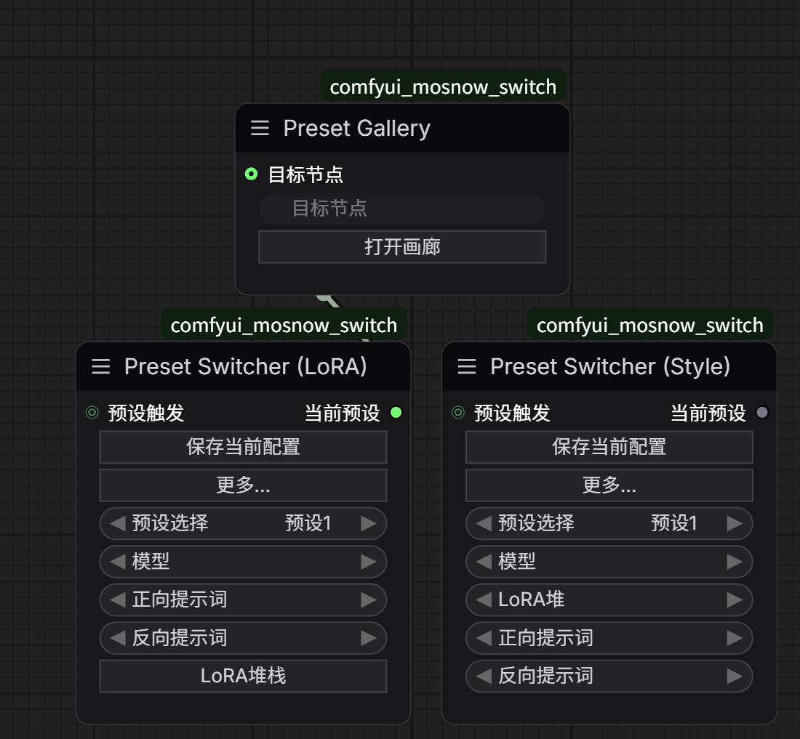

# ComfyUI Preset Switcher

预设管理与切换工具 — 保存/切换风格和 LoRA 配置，带可视化画廊。

Preset management & switching tool — save/switch style and LoRA configs with a visual gallery.

---

## 📸 截图 / Screenshot



---

## 📦 安装 / Installation

### ComfyUI Manager（推荐）

在 ComfyUI Manager 中搜索 `Preset Switcher` 并安装。

### 手动安装 / Manual

```bash
cd ComfyUI/custom_nodes/
git clone https://github.com/MosnowLab/ComfyUI-Preset-Switcher.git
```

重启 ComfyUI。无需额外 Python 依赖。 / Restart ComfyUI. No extra Python dependencies.

---

## 🧩 节点 / Nodes

| 节点 Node | 中文名 | 功能 |
|---|---|---|
| `Preset Switcher (Style)` | 预设切换器(效率) | 保存/切换风格预设（模型、LoRA、提示词） |
| `Preset Switcher (LoRA)` | 预设切换器(lora) | 管理 LoRA 堆栈预设，集成 Comfyroll LoRA Stack |
| `Preset Gallery` | 预设展示图 | 可视化画廊，上传预览图，点击切换预设 |

> 节点名根据 ComfyUI 语言设置自动切换中英文显示。

---

## 📖 使用示例 / Usage

### 预设切换器

1. 添加节点到工作流
2. 通过下拉框连接模型、LoRA、提示词节点
3. 点击 **保存当前配置** → 输入名称 → 预设已保存
4. 下拉框切换预设，自动应用配置

### 预设画廊

1. 连线或下拉框连接到预设切换器节点
2. 点击 **打开画廊** → 可视化浏览所有预设
3. 点击/拖拽上传每个预设的预览图
4. 点击预设卡片即可切换

---

## 🌐 国际化 / i18n

自动检测 ComfyUI 语言设置，支持中文 / English。翻译文件位于 `locales/` 目录，可直接编辑。

---

## 📄 许可证 / License

MIT